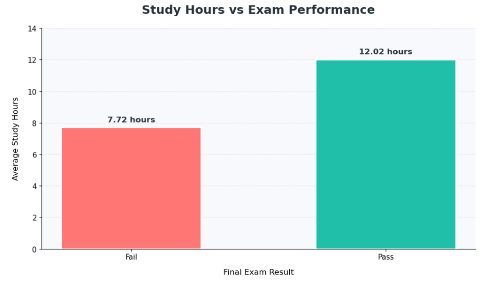
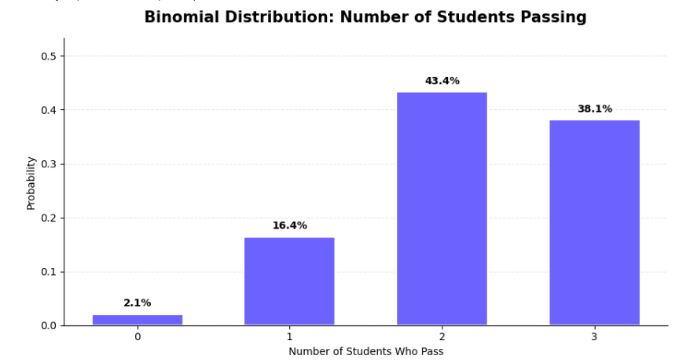
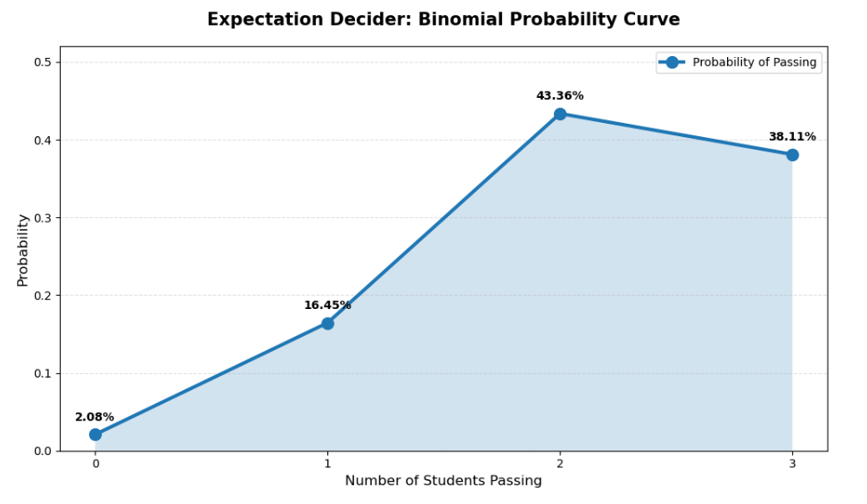
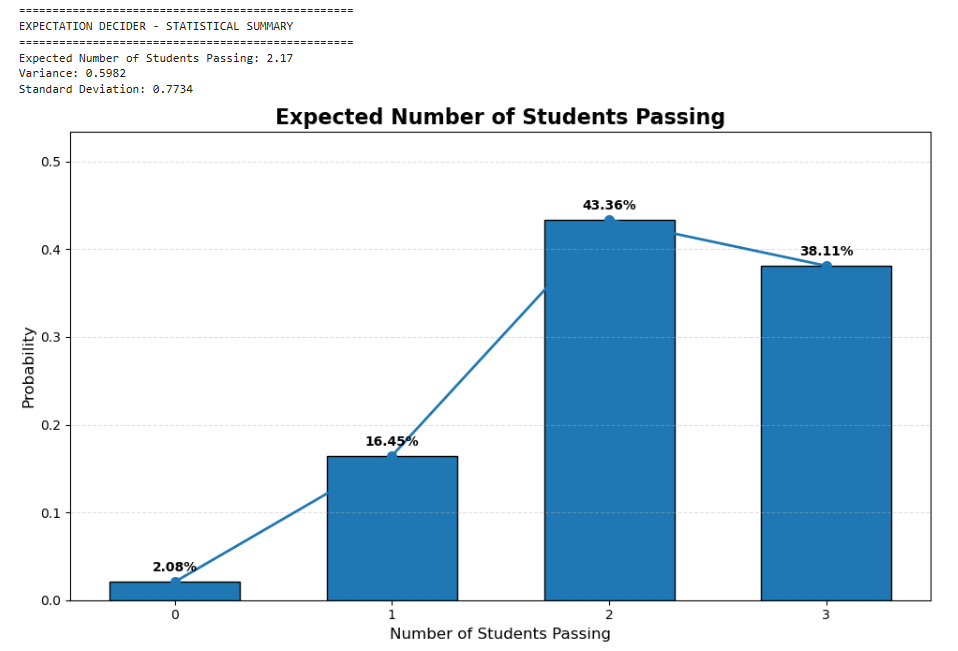
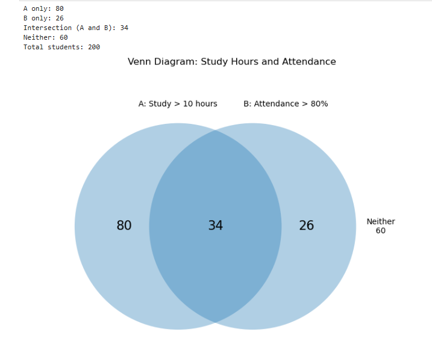

# 📊 Expectation-Decider
### Probability, Statistical Analysis & Data Visualization Using Python

An exploratory data analysis project that applies probability theory and statistical methods to understand student study habits, attendance patterns, and examination performance through Python-based calculations and visualizations.

---

## 📌 Table of Contents

- [Project Overview](#-project-overview)
- [Objectives](#-project-objectives)
- [Technologies Used](#-technologies-used)
- [Project Structure](#-project-structure)
- [Dataset Description](#-dataset-description)
- [Statistical Analysis](#-statistical-analysis)
- [Project Outputs](#-project-outputs)
- [Key Results](#-key-results)
- [Installation and Usage](#-installation-and-usage)
- [Future Enhancements](#-future-enhancements)
- [Author](#-author)
- [License](#-license)

---

## 📖 Project Overview

**Expectation-Decider** explores how probability and statistical analysis can be applied to student-related data. The project combines data processing, probability calculations, and graphical representations to make statistical concepts easier to understand.

Using Python and Jupyter Notebook, the project investigates study hours, attendance thresholds, examination outcomes, and binomial probability distributions.

The repository includes the analysis notebook, dataset, and generated visualizations.

## 🎯 Project Objectives

- Analyze study hours in relation to examination results.
- Explore the relationship between study habits and attendance.
- Understand binomial probability distributions.
- Calculate expected values, variance, and standard deviation.
- Demonstrate set theory using a Venn diagram.
- Present statistical results through clear, informative charts.

## 🛠️ Technologies Used

| Technology | Purpose |
|---|---|
| Python | Statistical calculations and analysis |
| Jupyter Notebook | Interactive code and analysis |
| Pandas | Data handling and manipulation |
| NumPy | Numerical computations |
| Matplotlib | Graphs and visualizations |
| Seaborn | Statistical visualization, if used |

## 📂 Project Structure

```text
Expectation-Decider/
│
├── Expectation_Decider.ipynb
├── expectation_decider_dataset.csv
│
├── study_hours_vs_exam_performance.png
├── binomial_probability_distribution.png
├── binomial_probability_curve.png
├── expected_students_passing.png
├── venn_diagram_study_attendance.png
│
├── .gitignore
├── LICENSE
└── README.md
```

## 📁 Dataset Description

**Dataset file:** `expectation_decider_dataset.csv`

The dataset supports the project's student-performance and probability analysis.

The analysis explores topics such as:

- Study hours and examination outcomes
- Attendance thresholds
- Student passing probabilities
- Statistical relationships within the dataset

Refer to the Jupyter Notebook for the actual dataset columns, preprocessing steps, calculations, and analytical implementation.

---

## 🧮 Statistical Analysis

The project demonstrates the following concepts:

**1. Probability and Conditional Probability**

Explores probabilities associated with events and their relationships.

**2. Binomial Distribution**

Models the probability of obtaining a particular number of successful outcomes across a fixed number of trials, subject to the model's assumptions.

**3. Expected Value**

Calculates the theoretical average outcome of a probability distribution.

**4. Variance and Standard Deviation**

Measures the spread and variability of probability outcomes.

**5. Set Theory and Venn Diagrams**

Illustrates the intersection and differences between study-hour and attendance groups.

**6. Exploratory Data Analysis**

Examines patterns in student study habits and examination performance through descriptive statistics and visualizations.

---

## 📸 Project Outputs & Visualizations

The following outputs provide a visual overview of the statistical analysis performed in the project.

### 1. Study Hours vs Exam Performance

Compares the average study hours of students who passed and those who failed.



*Insight:* In the analyzed dataset, students who passed had a higher average number of study hours than students who failed. This shows an association in the dataset, not proof that study hours alone determine examination results.

### 2. Binomial Probability Distribution

Shows the probabilities associated with different possible numbers of students passing under the specified binomial model.



*Purpose:* Helps visualize the likelihood of different successful-outcome counts.

### 3. Binomial Probability Curve

Displays how the probability varies across possible numbers of passing outcomes.



*Purpose:* Provides a complementary view of the binomial probability distribution.

### 4. Expected Number of Students Passing

Combines the probability distribution with a visual representation of the expected passing count.



*Purpose:* Demonstrates expected value and the interpretation of probabilities in a binomial model.

### 5. Study Hours and Attendance — Venn Diagram

Shows the relationship between two groups:

- **Set A:** Students studying more than 10 hours.
- **Set B:** Students with attendance above 80%.



*Purpose:* Illustrates the intersection, individual groups, and students who meet neither condition.

---

## 📊 Key Results

The project generates the following types of analytical results:

- Average study hours compared by examination outcome.
- Probability distribution for possible passing counts.
- Expected value, variance, and standard deviation.
- Group overlap based on study hours and attendance.
- Visual summaries of probability and statistical patterns.

The numerical results depend on the dataset and the model parameters used in the notebook. Refer to the executed notebook cells for the corresponding values.

## 🚀 Installation and Usage

### Prerequisites

- Python 3.x
- Jupyter Notebook
- Required Python libraries

### Step 1: Clone the Repository

```bash
git clone https://github.com/Yashraj-datascience-ml/Expectation-Decider.git
```

### Step 2: Navigate to the Project Directory

```bash
cd Expectation-Decider
```

### Step 3: Install Dependencies

```bash
pip install pandas numpy matplotlib seaborn jupyter
```

Install Seaborn only if it is used by the notebook.

### Step 4: Launch Jupyter Notebook

```bash
jupyter notebook
```

### Step 5: Run the Analysis

Open `Expectation_Decider.ipynb` and execute the cells in sequence.

Ensure the CSV dataset is available at the path expected by the notebook.

---

## 🔮 Future Enhancements

- Develop an interactive dashboard using Streamlit.
- Add more detailed conditional probability examples.
- Introduce interactive data filters.
- Compare additional probability distributions.
- Generate automated statistical reports.
- Expand the analysis with additional relevant data.

## 👨‍💻 Author

**Yashraj-datascience-ml**

GitHub Profile: [github.com/Yashraj-datascience-ml](https://github.com/Yashraj-datascience-ml)

Project Repository: [Expectation-Decider](https://github.com/Yashraj-datascience-ml/Expectation-Decider)

## 📄 License

This project is licensed under the **MIT License**. See the [LICENSE](LICENSE) file for details.

---

*This project is intended for educational purposes and demonstrates the application of probability, statistical analysis, and data visualization using Python.*

⭐ If you find this project interesting, consider starring the repository!
